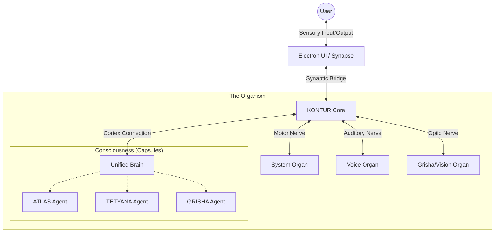

# ATLAS-KONTUR: The Unified Organism

> "The Body provides the means; the Mind provides the meaning."

## 1. Conceptual Vision

**ATLAS-KONTUR** is not merely a software application with chatbots; it is a **cybernetic organism** designed to simulate a living digital entity. The system architecture mimics biological principles, distinguishing between the neurological infrastructure (The Body) and the agentic cognition (The Mind).

### The Body: KONTUR (v11.0)
**KONTUR** is the nervous system. It handles signals, reflexes, sensory input, and motor output. It does not "think"—it reacts, transmits, and executes.
- **Core (Dispatcher)**: The spinal cord. Routes billion-scale signals between organs using the `Nexus` protocol.
- **Synapse**: The sensory bridge. Connects the user interface (Skin/Eyes) to the deep internals.
- **Organs**: Modular functional units (Vision, Voice, Motor/System Control) that perform specific tasks.

### The Mind: ATLAS
**ATLAS** is the consciousness. It resides within the body, interpreting sensory data from Kontur and issuing high-level commands.
- **Atlas (The Self)**: Planning, reasoning, strategy.
- **Tetyana (The Hands)**: Executive function, tool usage, file manipulation.
- **Grisha (The Eyes)**: Visual cortex, security monitoring, threat detection.

---

## 2. Deep Integration Architecture

In the unified model, the application does not "start services"; it **awakes**.

### The Unification Protocol (`DeepIntegrationSystem`)
The system is brought to life via the `DeepIntegrationSystem`. This kernel:
1.  **Boots the Core**: Establishes the message bus.
2.  **Spawns Organs**: Activates capabilities (Python workers, System control).
3.  **Wakes the Agents**: Initializes the Capsules (ATLAS, TETYANA, GRISHA) and connects them to the brain.
4.  **Syncs Synapses**: Binds the Electron UI to the internal state.

### Flux of Information
1.  **Perception**: `GrishaObserver` (Vision) or `VoiceCapsule` (Hearing) captures raw data.
2.  **Transmission**: Data travels via `Synapse` to `Core`.
3.  **Cognition**: `Core` routes data to the `UnifiedBrain`. Agents perceive the event.
4.  **Reaction**: Agents decide an action (Speak, Execute Command).
5.  **Execution**: `Core` routes the command to `SystemOrgan` or `VoiceOrgan`.

## 3. Localization & Compliance
- **Internal Dialect**: `English` (Strict System-Level). All logs, tool names, and code comments.
- **External Voice**: `Ukrainian` (Strict User-Level). All TTS, Chat responses, and UI labels.

This architecture ensures that ATLAS is not just "using" tools, but "embodying" them.
